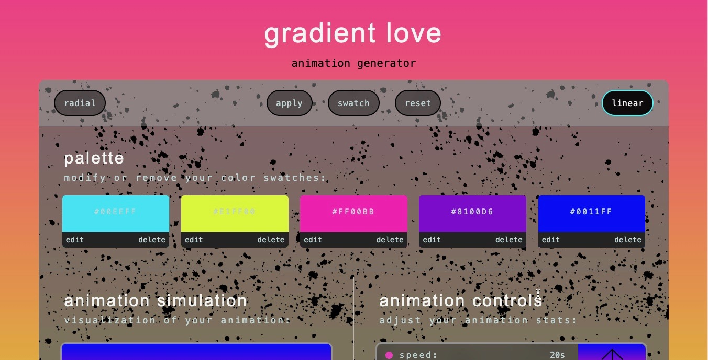
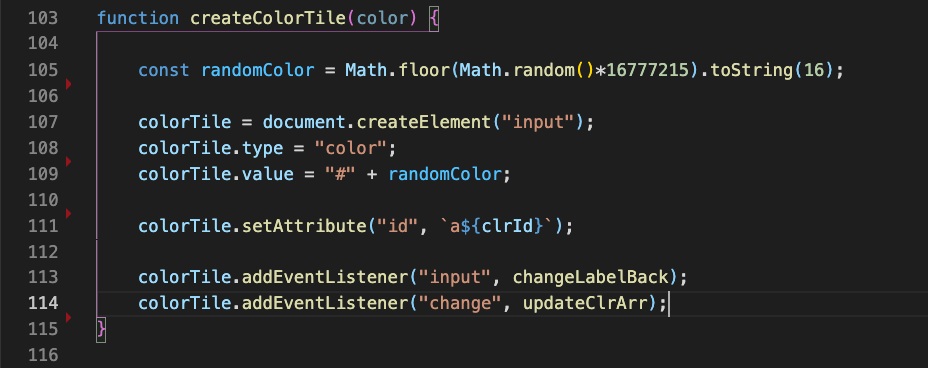
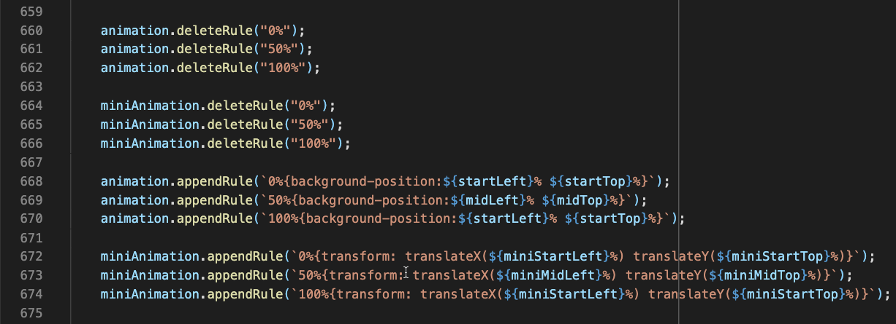

# [Gradient Love](https://cfthorne83.github.io/gradient-love/)
<!--  -->
f

## Background and Overview
- [Gradient Love](https://cfthorne83.github.io/gradient-love/) is a tool allowing users to dynamically create custom animated gradient backgrounds.

## Functionality and MVPs
- Users may toggle between linear or radial gradient types.
- Users may add, edit, or delete color swatches to be applied to the gradient.

- Users may control the speed of the gradient animation, the angle of the gradient, and the direction of the scroll angle.

- A CSS animation code display with real time response to user controls allows for effortless code copy and personal reuse.
- An animation simulator immediately mimics the speed, trajectory, and visualization of the gradient animation.  

## Architecture and Technology
- JavaScript
- HTML
- Sass
- Webpack for bundling JS files

# cfthorne83.github.io
